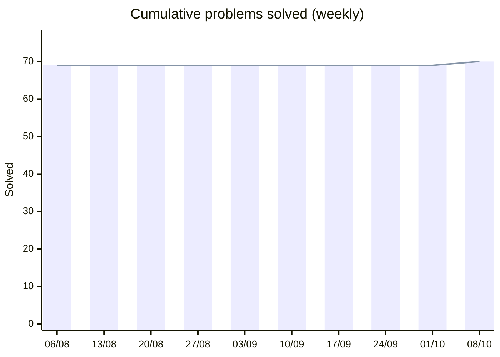
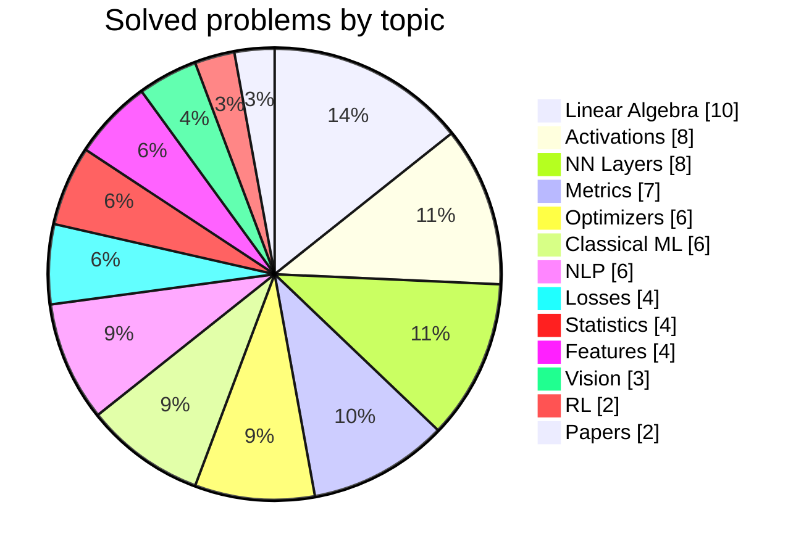

<!-- ⚠️ EDIT THIS FILE, NOT README.md — README.md is regenerated automatically by .github/workflows/update-readme.yml -->
<div align="center">


<br/>

[](#-solutions)
[](#)
[](#)
[](https://github.com/HarryTrn/TensorTonic-Solutions/commits/main)
[](https://github.com/HarryTrn/TensorTonic-Solutions/commits/main)

[](https://www.tensortonic.com/profile/_shinomiyaa_)

**[About](#-about)** · **[Progress](#-progress)** · **[Recent](#-recently-solved)** · **[Featured](#-featured-implementations)** · **[Solutions](#-solutions)** · **[Roadmap](#-roadmap)** · **[Connect](#-connect)**

</div>

---

## 🧠 About

This repository is my daily training log on **[TensorTonic](https://www.tensortonic.com)** — a platform for implementing the core algorithms of Machine Learning **from scratch**.

No high-level ML frameworks. Every optimizer, loss, layer and metric here is written by hand in Python + NumPy, so that the math is understood rather than called.

<table>
<tr>
<td width="33%" valign="top">

**📐 Math first**<br/>
Derive the formula, then write the code. Numerical stability (log-sum-exp, clamping, epsilon terms) is handled explicitly.

</td>
<td width="33%" valign="top">

**⚙️ From first principles**<br/>
From dot products up to GRU cells, attention masks and Nadam — each building block implemented without black boxes.

</td>
<td width="33%" valign="top">

**🎯 Interview & research ready**<br/>
Covers the fundamentals most often asked in ML interviews and used daily when reading papers.

</td>
</tr>
</table>

---

## 📊 Progress

<div align="center">

| 🧩 Solved | 🗂️ Topics | 🔥 Last 7 days | 📅 Last 30 days | 🔄 Last updated |
|:--:|:--:|:--:|:--:|:--:|
| **70** | **13** | **+1** | **+1** | 2026-10-08 |

</div>





| Topic | Solved | Topic | Solved |
|:--|:--:|:--|:--:|
| [📐 Linear Algebra & Vectors](#linear-algebra) | 10 | [🎲 Probability & Statistics](#stats) | 4 |
| [⚡ Activation Functions](#activations) | 8 | [🛠️ Feature Engineering](#features) | 4 |
| [🧱 Neural Network Layers](#layers) | 8 | [🔤 NLP & Transformers](#nlp) | 6 |
| [🚀 Optimizers & Training](#optimizers) | 6 | [🖼️ Computer Vision](#cv) | 3 |
| [📉 Loss Functions](#losses) | 4 | [🕹️ Reinforcement Learning](#rl) | 2 |
| [📏 Evaluation Metrics](#metrics) | 7 | [📄 Paper Implementations](#papers) | 2 |
| [🌳 Classical Machine Learning](#classical) | 6 | **Total** | **70** |

### 🕒 Recently Solved

| Date | Problem | Topic | Code |
|:--|:--|:--|:-:|
| 2026-10-08 | [Weighted Moving Average](https://www.tensortonic.com/problems/weighted-moving-average) | 🎲 Statistics | [📁](./weighted-moving-average) |
| 2026-05-04 | [Hinge Loss](https://www.tensortonic.com/problems/hinge-loss) | 📉 Losses | [📁](./hinge-loss) |
| 2026-04-26 | [Silhouette Score](https://www.tensortonic.com/problems/silhouette-score) | 📏 Metrics | [📁](./silhouette-score) |
| 2026-04-25 | [Policy Gradient Loss](https://www.tensortonic.com/problems/policy-gradient-loss) | 🕹️ RL | [📁](./policy-gradient-loss) |
| 2026-04-23 | [Global Average Pooling](https://www.tensortonic.com/problems/global-avg-pooling) | 🧱 NN Layers | [📁](./global-avg-pooling) |

---

## ⭐ Featured Implementations

Some of the problems I found most instructive:

| Implementation | Why it matters |
|:--|:--|
| [**Adam**](./adam-optimizer) → [**Nadam**](./nadam-optimizer) | First/second moments, bias correction, then adding Nesterov look-ahead — the optimizer behind most modern training. |
| [**GRU Cell**](./gru-cell-forward) | Reset/update gating built by hand; the core idea behind gated recurrent memory. |
| [**Causal Masking**](./causal-masking) + [**Positional Encoding**](./positional-encoding) | Two of the essential ingredients of a decoder-only Transformer. |
| [**Simple CNN Layer**](./simple-cnn-layer) | Batched multi-channel convolution without any deep learning framework. |
| [**Expected Calibration Error**](./expected-calibration-error) | Goes beyond accuracy: measures whether a model's confidence can be trusted. |

---

## 📚 Solutions

> Each problem lives in its own folder. **Problem** links to TensorTonic; **Code** links to my solution.

<a id="linear-algebra"></a>
<details open>
<summary><b>📐 Linear Algebra & Vectors (10)</b></summary>
<br/>

| # | Problem | Key idea | Code |
|:-:|:--|:--|:-:|
| 1 | [Angle Between 3D Vectors](https://www.tensortonic.com/problems/angle-between-3d) | arccos with clamped cosine | [📁](./angle-between-3d) |
| 2 | [Cosine Similarity](https://www.tensortonic.com/problems/cosine-similarity) | Normalized dot product, zero-vector safe | [📁](./cosine-similarity) |
| 3 | [Covariance Matrix](https://www.tensortonic.com/problems/covariance-matrix) | Sample covariance from centered data | [📁](./covariance-matrix) |
| 4 | [Dot Product](https://www.tensortonic.com/problems/dot-product) | Sum of element-wise products | [📁](./dot-product) |
| 5 | [Euclidean Distance](https://www.tensortonic.com/problems/euclidean-distance) | √Σ(xᵢ − yᵢ)² | [📁](./euclidean-distance) |
| 6 | [Matrix Inverse](https://www.tensortonic.com/problems/matrix-inverse) | Singular / non-square detection | [📁](./matrix-inverse) |
| 7 | [Matrix Normalization](https://www.tensortonic.com/problems/matrix-normalization) | Axis-wise norms | [📁](./matrix-normalization) |
| 8 | [Matrix Trace](https://www.tensortonic.com/problems/matrix-trace) | Sum of the main diagonal | [📁](./matrix-trace) |
| 9 | [Normalize 3D Vectors](https://www.tensortonic.com/problems/normalize-3d) | Unit vectors, zero-norm handling | [📁](./normalize-3d) |
| 10 | [3D Vector Norm](https://www.tensortonic.com/problems/vector-norm-3d) | L2 norm | [📁](./vector-norm-3d) |

</details>

<a id="activations"></a>
<details>
<summary><b>⚡ Activation Functions (8)</b></summary>
<br/>

| # | Problem | Key idea | Code |
|:-:|:--|:--|:-:|
| 1 | [ELU](https://www.tensortonic.com/problems/elu-activation) | Exponential negative branch | [📁](./elu-activation) |
| 2 | [GELU](https://www.tensortonic.com/problems/gelu) | Gaussian error linear unit | [📁](./gelu) |
| 3 | [Leaky ReLU](https://www.tensortonic.com/problems/leaky-relu) | Configurable negative slope α | [📁](./leaky-relu) |
| 4 | [SELU](https://www.tensortonic.com/problems/selu-activation) | Self-normalizing scale | [📁](./selu-activation) |
| 5 | [Sigmoid](https://www.tensortonic.com/problems/sigmoid-numpy) | Stable for large ± inputs | [📁](./sigmoid-numpy) |
| 6 | [Softmax](https://www.tensortonic.com/problems/softmax-function) | Max-shift for numerical stability | [📁](./softmax-function) |
| 7 | [Swish](https://www.tensortonic.com/problems/swish-activation) | x · σ(x) | [📁](./swish-activation) |
| 8 | [Tanh](https://www.tensortonic.com/problems/tanh-activation) | Bounded in (−1, 1) | [📁](./tanh-activation) |

</details>

<a id="layers"></a>
<details>
<summary><b>🧱 Neural Network Layers (8)</b></summary>
<br/>

| # | Problem | Key idea | Code |
|:-:|:--|:--|:-:|
| 1 | [Batch Normalization](https://www.tensortonic.com/problems/batch-normalization) | Feature-wise stats, γ / β | [📁](./batch-normalization) |
| 2 | [Dropout (Training)](https://www.tensortonic.com/problems/dropout-training) | Inverted dropout scaling | [📁](./dropout-training) |
| 3 | [Global Average Pooling](https://www.tensortonic.com/problems/global-avg-pooling) | Per-channel spatial mean | [📁](./global-avg-pooling) |
| 4 | [GRU Cell Forward](https://www.tensortonic.com/problems/gru-cell-forward) | Reset / update / candidate gates | [📁](./gru-cell-forward) |
| 5 | [Linear Layer Forward](https://www.tensortonic.com/problems/linear-layer-forward) | xW + b | [📁](./linear-layer-forward) |
| 6 | [Max Pooling](https://www.tensortonic.com/problems/maxpool-forward) | Window + stride | [📁](./maxpool-forward) |
| 7 | [RNN Step Forward](https://www.tensortonic.com/problems/rnn-step-forward) | tanh recurrent cell | [📁](./rnn-step-forward) |
| 8 | [Simple CNN Layer](https://www.tensortonic.com/problems/simple-cnn-layer) | Batched multi-channel convolution | [📁](./simple-cnn-layer) |

</details>

<a id="optimizers"></a>
<details>
<summary><b>🚀 Optimizers & Training (6)</b></summary>
<br/>

| # | Problem | Key idea | Code |
|:-:|:--|:--|:-:|
| 1 | [AdaGrad](https://www.tensortonic.com/problems/adagrad-optimizer) | Accumulated squared gradients | [📁](./adagrad-optimizer) |
| 2 | [Adam](https://www.tensortonic.com/problems/adam-optimizer) | Moments + bias correction | [📁](./adam-optimizer) |
| 3 | [Gradient Clipping](https://www.tensortonic.com/problems/gradient-clipping) | Global L2-norm clipping | [📁](./gradient-clipping) |
| 4 | [Gradient Descent (1D Quadratic)](https://www.tensortonic.com/problems/gradient-descent-quadratic) | Iterative parameter updates | [📁](./gradient-descent-quadratic) |
| 5 | [Linear LR Scheduler](https://www.tensortonic.com/problems/linear-lr-scheduler) | Linear decay schedule | [📁](./linear-lr-scheduler) |
| 6 | [Nadam](https://www.tensortonic.com/problems/nadam-optimizer) | Adam + Nesterov momentum | [📁](./nadam-optimizer) |

</details>

<a id="losses"></a>
<details>
<summary><b>📉 Loss Functions (4)</b></summary>
<br/>

| # | Problem | Key idea | Code |
|:-:|:--|:--|:-:|
| 1 | [Dice Loss](https://www.tensortonic.com/problems/dice-loss) | Overlap loss for segmentation | [📁](./dice-loss) |
| 2 | [Focal Loss](https://www.tensortonic.com/problems/focal-loss) | Down-weights easy examples | [📁](./focal-loss) |
| 3 | [Hinge Loss](https://www.tensortonic.com/problems/hinge-loss) | Margin-based SVM loss | [📁](./hinge-loss) |
| 4 | [Mean Squared Error](https://www.tensortonic.com/problems/mean-squared-error) | Mean of squared residuals | [📁](./mean-squared-error) |

</details>

<a id="metrics"></a>
<details>
<summary><b>📏 Evaluation Metrics (7)</b></summary>
<br/>

| # | Problem | Key idea | Code |
|:-:|:--|:--|:-:|
| 1 | [AUC (ROC)](https://www.tensortonic.com/problems/auc) | Trapezoidal integration | [📁](./auc) |
| 2 | [Confusion Matrix](https://www.tensortonic.com/problems/confusion-matrix-norm) | Row / column normalization | [📁](./confusion-matrix-norm) |
| 3 | [Expected Calibration Error](https://www.tensortonic.com/problems/expected-calibration-error) | Confidence vs. accuracy gap | [📁](./expected-calibration-error) |
| 4 | [Micro-F1](https://www.tensortonic.com/problems/metrics-f1-micro) | Aggregated TP / FP / FN | [📁](./metrics-f1-micro) |
| 5 | [NDCG](https://www.tensortonic.com/problems/ndcg) | Ranking quality at K | [📁](./ndcg) |
| 6 | [Perplexity](https://www.tensortonic.com/problems/perplexity-computation) | Language-model evaluation | [📁](./perplexity-computation) |
| 7 | [Silhouette Score](https://www.tensortonic.com/problems/silhouette-score) | Clustering quality | [📁](./silhouette-score) |

</details>

<a id="classical"></a>
<details>
<summary><b>🌳 Classical Machine Learning (6)</b></summary>
<br/>

| # | Problem | Key idea | Code |
|:-:|:--|:--|:-:|
| 1 | [Information Gain](https://www.tensortonic.com/problems/information-gain) | Entropy-based tree splits | [📁](./information-gain) |
| 2 | [Jaccard Similarity](https://www.tensortonic.com/problems/jaccard-similarity) | Intersection over union of sets | [📁](./jaccard-similarity) |
| 3 | [K-Means Assignment](https://www.tensortonic.com/problems/k-means-assignment) | Nearest-centroid assignment | [📁](./k-means-assignment) |
| 4 | [K-Means Centroid Update](https://www.tensortonic.com/problems/k-means-centroid-update) | Cluster means, empty clusters | [📁](./k-means-centroid-update) |
| 5 | [KNN Distance + Lookup](https://www.tensortonic.com/problems/knn-distance) | Nearest-neighbor search | [📁](./knn-distance) |
| 6 | [Ridge Regression](https://www.tensortonic.com/problems/ridge-regression) | Closed-form L2 regularization | [📁](./ridge-regression) |

</details>

<a id="stats"></a>
<details>
<summary><b>🎲 Probability & Statistics (4)</b></summary>
<br/>

| # | Problem | Key idea | Code |
|:-:|:--|:--|:-:|
| 1 | [Binomial PMF / CDF](https://www.tensortonic.com/problems/binomial-pmf-cdf) | Combinatorics + cumulative sums | [📁](./binomial-pmf-cdf) |
| 2 | [Expected Value](https://www.tensortonic.com/problems/expected-value-discrete) | Discrete distributions | [📁](./expected-value-discrete) |
| 3 | [Mean, Median, Mode](https://www.tensortonic.com/problems/mean-median-mode) | Deterministic tie handling | [📁](./mean-median-mode) |
| 4 | [Weighted Moving Average](https://www.tensortonic.com/problems/weighted-moving-average) 🆕 | Normalized window weights | [📁](./weighted-moving-average) |

</details>

<a id="features"></a>
<details>
<summary><b>🛠️ Feature Engineering (4)</b></summary>
<br/>

| # | Problem | Key idea | Code |
|:-:|:--|:--|:-:|
| 1 | [Binning](https://www.tensortonic.com/problems/binning) | Interval edge handling | [📁](./binning) |
| 2 | [Log Transform](https://www.tensortonic.com/problems/log-transform) | Numerically safe log | [📁](./log-transform) |
| 3 | [Rank Transform](https://www.tensortonic.com/problems/rank-transform) | Tie policies | [📁](./rank-transform) |
| 4 | [Robust Scaling](https://www.tensortonic.com/problems/robust-scaling) | Median + IQR | [📁](./robust-scaling) |

</details>

<a id="nlp"></a>
<details>
<summary><b>🔤 NLP & Transformers (6)</b></summary>
<br/>

| # | Problem | Key idea | Code |
|:-:|:--|:--|:-:|
| 1 | [Bag-of-Words](https://www.tensortonic.com/problems/bag-of-words) | Count vectors over a vocabulary | [📁](./bag-of-words) |
| 2 | [Causal Masking](https://www.tensortonic.com/problems/causal-masking) | Block attention to future tokens | [📁](./causal-masking) |
| 3 | [Positional Encoding](https://www.tensortonic.com/problems/positional-encoding) | Sinusoidal sin / cos | [📁](./positional-encoding) |
| 4 | [Remove Stopwords](https://www.tensortonic.com/problems/remove-stopwords) | Order-preserving filtering | [📁](./remove-stopwords) |
| 5 | [Text Chunking](https://www.tensortonic.com/problems/text-chunking) | Size + overlap (RAG-style) | [📁](./text-chunking) |
| 6 | [Word Count Dictionary](https://www.tensortonic.com/problems/word-count-dict) | Token frequencies | [📁](./word-count-dict) |

</details>

<a id="cv"></a>
<details>
<summary><b>🖼️ Computer Vision (3)</b></summary>
<br/>

| # | Problem | Key idea | Code |
|:-:|:--|:--|:-:|
| 1 | [Anchor Box Generation](https://www.tensortonic.com/problems/anchor-box-generation) | Scales × aspect ratios | [📁](./anchor-box-generation) |
| 2 | [Image Histogram](https://www.tensortonic.com/problems/image-histogram) | Intensity binning | [📁](./image-histogram) |
| 3 | [IoU (Bounding Box)](https://www.tensortonic.com/problems/iou-bounding-box) | Overlap / union area | [📁](./iou-bounding-box) |

</details>

<a id="rl"></a>
<details>
<summary><b>🕹️ Reinforcement Learning (2)</b></summary>
<br/>

| # | Problem | Key idea | Code |
|:-:|:--|:--|:-:|
| 1 | [Monte Carlo Policy Evaluation](https://www.tensortonic.com/problems/mc-policy-evaluation) | Averaging discounted returns | [📁](./mc-policy-evaluation) |
| 2 | [Policy Gradient Loss](https://www.tensortonic.com/problems/policy-gradient-loss) | log π(a|s) · advantage | [📁](./policy-gradient-loss) |

</details>

<a id="papers"></a>
<details>
<summary><b>📄 Paper Implementations (2)</b></summary>
<br/>

| # | Problem | Key idea | Code |
|:-:|:--|:--|:-:|
| 1 | [AlexNet · Dropout Regularization](https://www.tensortonic.com/research/alexnet/alexnet-dropout) | Seeded masks, train vs. inference | [📁](./alexnet/alexnet-dropout) |
| 2 | [AlexNet · ReLU Activation](https://www.tensortonic.com/research/alexnet/alexnet-relu) | Non-saturating activation | [📁](./alexnet/alexnet-relu) |

</details>

---

## 🗺️ Roadmap

- [x] Linear algebra & statistics foundations
- [x] Activations, losses and optimizers
- [x] RNN / GRU and CNN building blocks
- [ ] Backpropagation for full MLPs
- [ ] Scaled dot-product & multi-head attention
- [ ] More paper implementations (ResNet, Transformer, …)

---

## 📁 Repository Structure

```
TensorTonic-Solutions/
├── adam-optimizer/        # one folder per problem
├── gru-cell-forward/
├── causal-masking/
├── ...
├── alexnet/               # research-track (paper) problems
└── README.md
```

---

## 🤝 Connect

<div align="center">

[](https://www.tensortonic.com/profile/_shinomiyaa_)
[](https://github.com/HarryTrn)
<!-- Replace YOUR_LINKEDIN and YOUR_EMAIL below, or delete these two lines -->
[](https://www.linkedin.com/in/YOUR_LINKEDIN/)
[](mailto:YOUR_EMAIL@gmail.com)

**If this repo helps you learn, consider giving it a ⭐**


</div>

<!-- tensortonic:start -->
# _Shinomiyaa_'s TensorTonic Solutions

Verified machine learning implementations completed on [TensorTonic](https://www.tensortonic.com).

<p align="center">
  
</p>

| Problem | Description | Link |
|---|---|---|
| AdaGrad Optimizer | Implement a vectorized AdaGrad update in NumPy with accumulated squared gradients and adaptive per-parameter learning rates. | https://www.tensortonic.com/problems/adagrad-optimizer |
| Implement Adam Optimizer Step | Implement one vectorized Adam optimizer step in NumPy with first and second moments, bias correction, and elementwise parameter updates. | https://www.tensortonic.com/problems/adam-optimizer |
| Anchor Box Generation | Generate object-detection anchor boxes across a feature grid for every scale and aspect-ratio combination. | https://www.tensortonic.com/problems/anchor-box-generation |
| Angle Between 3D Vectors | Compute the angle between two 3D vectors in NumPy with clamped cosine values and safe handling of zero norms. | https://www.tensortonic.com/problems/angle-between-3d |
| Compute AUC (Area Under ROC) | Calculate binary-classification ROC AUC from false-positive and true-positive rates using trapezoidal integration. | https://www.tensortonic.com/problems/auc |
| Bag-of-Words Vector | Build a NumPy bag-of-words count vector from an ordered vocabulary while ignoring out-of-vocabulary tokens. | https://www.tensortonic.com/problems/bag-of-words |
| Batch Normalization (Forward) | Implement the batch-normalization forward pass in NumPy using feature-wise statistics, scale, shift, and numerical stability. | https://www.tensortonic.com/problems/batch-normalization |
| Binning | Assign numeric values to ordered bins using supplied boundaries while handling values at interval edges. | https://www.tensortonic.com/problems/binning |
| Binomial Probability Mass Function | Compute binomial probability mass and cumulative probabilities from trial count, success probability, and outcome. | https://www.tensortonic.com/problems/binomial-pmf-cdf |
| Implement Causal Masking for Attention | Create a causal attention mask that blocks each token from attending to future positions in a sequence. | https://www.tensortonic.com/problems/causal-masking |
| Compute Confusion Matrix with Normalization | Build a multiclass confusion matrix and optionally normalize counts by true-class rows or predicted-class columns. | https://www.tensortonic.com/problems/confusion-matrix-norm |
| Implement Cosine Similarity | Compute cosine similarity between NumPy vectors with dot products, Euclidean norms, and zero-vector handling. | https://www.tensortonic.com/problems/cosine-similarity |
| Compute Covariance Matrix | Compute a sample covariance matrix from centered observations, preserving feature-to-feature relationships. | https://www.tensortonic.com/problems/covariance-matrix |
| Implement Dice Loss | Compute Dice loss for segmentation predictions using overlap, total mass, and a numerical smoothing term. | https://www.tensortonic.com/problems/dice-loss |
| Implement Dot Product | Implement the dot product of equal-length numeric vectors by summing element-wise products without library shortcuts. | https://www.tensortonic.com/problems/dot-product |
| Implement Dropout (Training Mode) | Implement training-mode dropout in NumPy with random masking and inverted scaling of retained activations. | https://www.tensortonic.com/problems/dropout-training |
| ELU Activation | Apply the ELU activation element-wise, retaining positive inputs and exponentially transforming negative values. | https://www.tensortonic.com/problems/elu-activation |
| Compute Entropy for a Node | Compute decision-tree node entropy from class labels using empirical class probabilities and base-two logarithms. | https://www.tensortonic.com/problems/entropy-node |
| Implement Euclidean Distance | Compute Euclidean distance between equal-length NumPy vectors as the square root of summed squared differences. | https://www.tensortonic.com/problems/euclidean-distance |
| Expected Calibration Error | Calculate expected calibration error by binning prediction confidence and weighting accuracy-confidence gaps. | https://www.tensortonic.com/problems/expected-calibration-error |
| Expected Value (Discrete Distribution) | Compute the expected value of a discrete distribution from matched outcomes and normalized probabilities. | https://www.tensortonic.com/problems/expected-value-discrete |
| Implement Focal Loss | Compute mean binary focal loss from predicted probabilities using a configurable focusing parameter. | https://www.tensortonic.com/problems/focal-loss |
| Implement GELU Activation (Gaussian Error Linear Unit) | Implement the Gaussian Error Linear Unit activation element-wise using the required GELU approximation. | https://www.tensortonic.com/problems/gelu |
| Implement Global Average Pooling | Apply global average pooling to spatial feature maps by averaging each channel across its height and width. | https://www.tensortonic.com/problems/global-avg-pooling |
| Gradient Clipping (Global Norm) | Clip a NumPy gradient array by its global L2 norm while preserving direction when scaling is required. | https://www.tensortonic.com/problems/gradient-clipping |
| Implement Gradient Descent for a 1D Quadratic | Optimize a one-dimensional quadratic with iterative gradient descent and return the parameter trajectory. | https://www.tensortonic.com/problems/gradient-descent-quadratic |
| Build a Mini GRU Cell (Forward Pass) | Implement a GRU cell forward pass with reset, update, and candidate gates for one sequence timestep. | https://www.tensortonic.com/problems/gru-cell-forward |
| Implement Hinge Loss (Binary SVM) | Compute binary SVM hinge loss from signed labels and prediction scores using the required margin. | https://www.tensortonic.com/problems/hinge-loss |
| Image Histogram | Count grayscale image pixels into intensity bins and return the histogram in ascending intensity order. | https://www.tensortonic.com/problems/image-histogram |
| Compute Information Gain for a Split | Compute information gain for a decision-tree split from parent entropy and weighted child entropies. | https://www.tensortonic.com/problems/information-gain |
| Intersection over Union (IoU) | Compute intersection over union for two axis-aligned bounding boxes from overlap and combined area. | https://www.tensortonic.com/problems/iou-bounding-box |
| Jaccard Similarity | Compute Jaccard similarity between two collections as intersection size divided by union size. | https://www.tensortonic.com/problems/jaccard-similarity |
| K-Means Assignment Step | Assign each sample to its nearest K-means centroid using Euclidean distance and deterministic tie handling. | https://www.tensortonic.com/problems/k-means-assignment |
| K-Means Centroid Update | Update K-means centroids as cluster means while applying the required behavior for empty clusters. | https://www.tensortonic.com/problems/k-means-centroid-update |
| KNN Distance + Neighbor Lookup | Find the nearest neighbors of a query point by computing and ordering Euclidean distances to training samples. | https://www.tensortonic.com/problems/knn-distance |
| Implement Leaky ReLU (with α) | Apply Leaky ReLU element-wise with a configurable negative slope while retaining positive inputs. | https://www.tensortonic.com/problems/leaky-relu |
| Linear Layer Forward | Implement a dense linear layer forward pass by multiplying inputs by weights and adding a bias vector. | https://www.tensortonic.com/problems/linear-layer-forward |
| Learning Rate Scheduler (Linear Decay) | Compute a linearly decaying learning rate across training steps between configured start and end values. | https://www.tensortonic.com/problems/linear-lr-scheduler |
| Log Transform | Apply a numerically safe logarithmic transform to numeric features using the required offset or base. | https://www.tensortonic.com/problems/log-transform |
| Matrix Inverse | Compute a square matrix inverse in NumPy while returning no result for invalid, non-square, or singular inputs. | https://www.tensortonic.com/problems/matrix-inverse |
| Implement Matrix Normalization | Normalize a NumPy matrix using the specified axis and norm while safely handling zero-magnitude slices. | https://www.tensortonic.com/problems/matrix-normalization |
| Matrix Trace | Compute the trace of a square matrix by summing its main diagonal entries without changing the input. | https://www.tensortonic.com/problems/matrix-trace |
| Matrix Transpose | Implement matrix transpose in NumPy without built-in transpose helpers, preserving rectangular shapes and the original input. | https://www.tensortonic.com/problems/matrix-transpose |
| Max Pooling Forward | Apply 2D max pooling to a numeric matrix using a configurable square window and stride. | https://www.tensortonic.com/problems/maxpool-forward |
| Monte Carlo Policy Evaluation | Estimate state values from complete Monte Carlo episodes by averaging discounted returns for each visited state. | https://www.tensortonic.com/problems/mc-policy-evaluation |
| Mean, Median, Mode | Calculate the mean, median, and deterministic mode of a numeric collection, including tied frequencies. | https://www.tensortonic.com/problems/mean-median-mode |
| Mean Squared Error (MSE) | Compute mean squared error between predictions and targets by averaging their squared element-wise differences. | https://www.tensortonic.com/problems/mean-squared-error |
| Implement Micro-F1 | Compute multiclass micro-F1 by aggregating true positives, false positives, and false negatives across labels. | https://www.tensortonic.com/problems/metrics-f1-micro |
| Implement Nadam (Nesterov + Adam) | Implement one Nadam optimizer step in NumPy by combining Adam moments with Nesterov momentum. | https://www.tensortonic.com/problems/nadam-optimizer |
| NDCG (Normalized Discounted Cumulative Gain) | Calculate normalized discounted cumulative gain at K from ranked relevance scores and their ideal ordering. | https://www.tensortonic.com/problems/ndcg |
| Normalize 3D Vectors | Normalize a 3D vector to unit length in NumPy while returning the required result for a zero vector. | https://www.tensortonic.com/problems/normalize-3d |
| Perplexity Computation | Compute language-model perplexity from token probability distributions and the observed token indices. | https://www.tensortonic.com/problems/perplexity-computation |
| Policy Gradient Loss | Compute policy-gradient loss from selected action probabilities and advantage estimates with stable logarithms. | https://www.tensortonic.com/problems/policy-gradient-loss |
| Implement Positional Encoding (sin/cos) | Generate sinusoidal Transformer positional encodings across sequence positions and embedding dimensions. | https://www.tensortonic.com/problems/positional-encoding |
| Rank Transform | Replace numeric values with their ranks while applying the specified policy to tied observations. | https://www.tensortonic.com/problems/rank-transform |
| Implement ReLU Activation | Apply the ReLU activation element-wise by replacing negative values with zero and preserving nonnegative inputs. | https://www.tensortonic.com/problems/relu-activation |
| Remove Stopwords | Remove tokens found in a supplied stopword collection while preserving the order of remaining words. | https://www.tensortonic.com/problems/remove-stopwords |
| Ridge Regression | Fit ridge regression with L2 regularization using the closed-form solution required by the problem. | https://www.tensortonic.com/problems/ridge-regression |
| RMSProp Optimizer (Single Update Step) | Implement one RMSProp update in NumPy using an exponential squared-gradient average and adaptive scaling. | https://www.tensortonic.com/problems/rmsprop-optimizer |
| RNN Step Forward (Tanh Cell) | Implement one vanilla RNN timestep with affine input and recurrent transforms followed by tanh activation. | https://www.tensortonic.com/problems/rnn-step-forward |
| Robust Scaling | Scale numeric features using their median and interquartile range with constant-spread handling. | https://www.tensortonic.com/problems/robust-scaling |
| SELU Activation | Apply SELU activation element-wise with scaled positive values and exponential negative values. | https://www.tensortonic.com/problems/selu-activation |
| Implement Sigmoid in NumPy | Implement a vectorized sigmoid activation in NumPy for scalars, lists, vectors, and matrices, including large positive and negative inputs. | https://www.tensortonic.com/problems/sigmoid-numpy |
| Compute Silhouette Score | Compute the mean silhouette score from intra-cluster and nearest-cluster distances for labeled samples. | https://www.tensortonic.com/problems/silhouette-score |
| Implement a Simple CNN Layer (NumPy) | Implement a NumPy CNN layer forward pass with batched valid convolution across channels and bias addition. | https://www.tensortonic.com/problems/simple-cnn-layer |
| Implement Softmax Function | Implement numerically stable softmax by shifting logits before exponentiation and normalizing probabilities. | https://www.tensortonic.com/problems/softmax-function |
| Implement Swish Activation | Apply the Swish activation element-wise by multiplying each input by its sigmoid value. | https://www.tensortonic.com/problems/swish-activation |
| Implement Tanh Activation | Implement the hyperbolic tangent activation element-wise with outputs bounded between minus one and one. | https://www.tensortonic.com/problems/tanh-activation |
| Text Chunking | Split text into ordered chunks under the requested size and overlap rules without dropping content. | https://www.tensortonic.com/problems/text-chunking |
| Compute 3D Vector Norm | Compute the Euclidean norm of a 3D vector from the square root of summed squared coordinates. | https://www.tensortonic.com/problems/vector-norm-3d |
| Weighted Moving Average | Compute a weighted moving average over complete time-series windows using normalized supplied weights. | https://www.tensortonic.com/problems/weighted-moving-average |
| Word Count Dictionary | Count token occurrences in text and return a dictionary mapping each distinct word to its frequency. | https://www.tensortonic.com/problems/word-count-dict |
| Dropout Regularization | Implement inverted dropout for AlexNet with seeded masks and training-versus-inference behavior. | https://www.tensortonic.com/research/alexnet/alexnet-dropout |
| ReLU Activation Function | Implement AlexNet's elementwise ReLU activation, preserving positive values while setting negative values to zero. | https://www.tensortonic.com/research/alexnet/alexnet-relu |

View my verified ML profile: [TensorTonic profile](https://www.tensortonic.com/profile/_shinomiyaa_)
<!-- tensortonic:end -->
